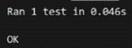

# Development Notes

* I havn't coded in 22 years so this a steep learning curve for me
* I did not join the session live, so I had to watch it the necxt day and I paused it af the point where Ryan started the implementation plan and I did all the following before watch ing the rest of the video

## Initial Setup

* Installed windsurf
* Copied the lang-portal/backend-flask folder
* Added the python extension to windsurf

## Implementation Plan

* Asked cascade to make implementation plan
* I had to create an empty md file for cascade to add the implementation plan into
* The plan looked good (see study_sessions_implementation) and had sections on:
  - Setup steps
  - Request validation steps
  - Implementation steps
  - Error handling steps
  - Testing steps
  - Testing code with a final checklist of items to check before deployment
  * I asked cascade to implement the steps one at a time
  - Cascade did the setup
  - When I asked for the next step it completed all the remaining steps except the tests, I was only expecting one at a time
  - It was only now I thought of numbering the steps so I did it

## Python Environment Setup

### Initial Setup Issues
- Got errors like "The term 'pip' is not recognized as the name of a cmdlet"
- Realized I had to install Python as well as the Python extension
- Created a virtual environment but didn't understand what it was about (Windsurf suggested it so I followed along)

### Python Installation Process
- Installed Python from Python.org but it wouldn't run even though the install did add its location to PATH
- Asked Cascade chat what to do to get Python running
  - Running `python -version` produced the response "Python was not found; run without arguments to install from the Microsoft Store"
  - Installed Python from Microsoft Store
  - Successfully ran `python -m venv venv`
  - Had to run this command first: `Set-ExecutionPolicy -Scope CurrentUser -ExecutionPolicy Unrestricted`
  - Also had to update pip: `python.exe -m pip install --upgrade pip`

### Installing Dependencies
- Installed required packages:
  ```bash
  pip install flask
  pip install pytest
  pip install flask-cors
  ```

## Unit Testing Process

### Initial Test Run
- Verified pytest installation was successful
- Asked Cascade to run the tests and it gave the following command but it failed
  -   `pytest tests/test_study_sessions.py -v`
- Pasted the error from venv console into the chat and it added another import `sys` and added the parent directory to the `sys.path`

### Test Fixes
- Next error required installing: `pip install Flask-CORS`
- Got error: "FAILED tests/test_study_sessions.py::test_create_study_session_invalid_foreign_key - assert 201 == 500"
- Cascade suggested changes to the test file **and the following change** to db.py:
  ```python
  # Enable foreign key constraints
  execute('PRAGMA foreign_keys = ON')
  ```

### Final Unit Testing
- After a couple more rounds of running the tests, we (me and Cascade, my new bff) got all the tests passing! except for an error with dateteime
```bash
tests/test_study_sessions.py::test_create_study_session_success PASSED [ 25%] 
tests/test_study_sessions.py::test_create_study_session_missing_fields PASSED   [ 50%] 
tests/test_study_sessions.py::test_create_study_session_invalid_content_type PASSED [ 75%] 
tests/test_study_sessions.py::test_create_study_session_invalid_foreign_key PASSED [100%] 

================================================================================================================= warnings summary ================================================================================================================== 
tests/test_study_sessions.py::test_create_study_session_success
tests/test_study_sessions.py::test_create_study_session_invalid_foreign_key
  C:\Users\Ollie\OneDrive\Documents\AI\CascadeProjects\free-genai-bootcamp-2025\lang-portal\backend-flask\routes\study_sessions.py:87: DeprecationWarning: datetime.datetime.utcnow() is deprecated and scheduled for removal in a future version. Use timezone-aware objects to represent datetimes in UTC: datetime.datetime.now(datetime.UTC).
    'created_at': datetime.utcnow().isoformat()

datetime.datetime.now(datetime.UTC)
```
- Watching the video later, I was really impressed with the output above (and all the previous iterations)compared to what Ryan got:
- 
- Asked cascade to fix the error with datetime but all 4 models came up with code I thought was wrong so I went old school and got an answer on https://www.andreagrandi.it/posts/python-now-time-to-migrate-from-utcnow/ to import timzone and replace `'created_at': datetime.utcnow().isoformat()` with `'created_at': datetime.now(timezone.utc).isoformat()` 
- I told cascade of the sucess and Cascade then updated our implementation plan to check the remaining boxes.
- Finally asked cascade to convert my notes to markdown and it addded headers and everything

## Manual Testing Process

* I asked cascade to add manual curl tests to the implemation plan